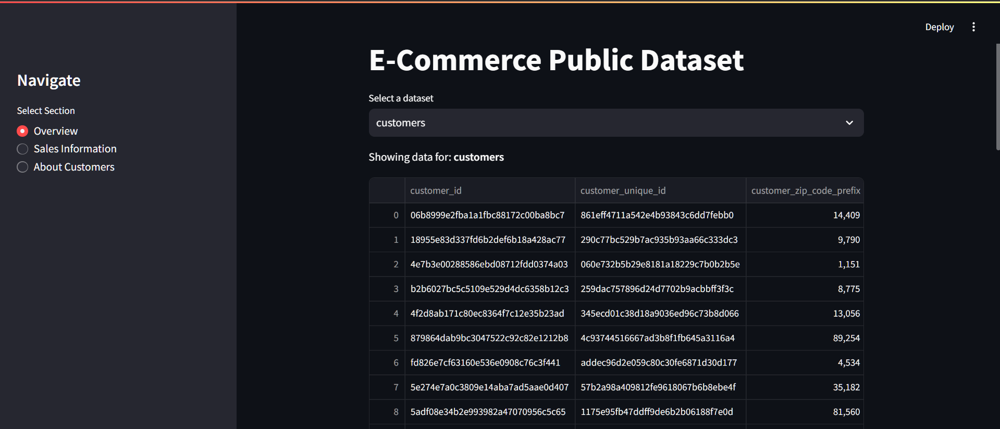
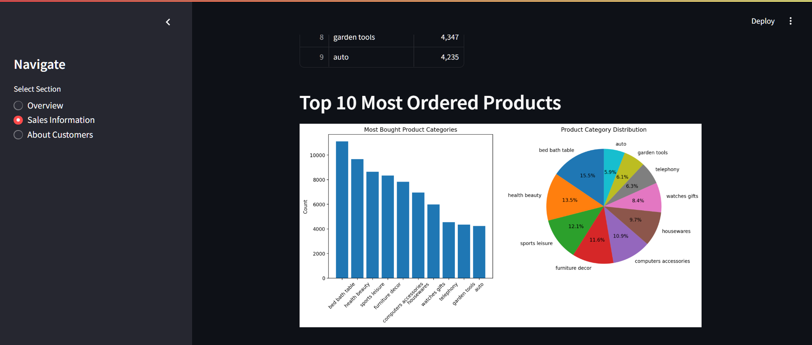
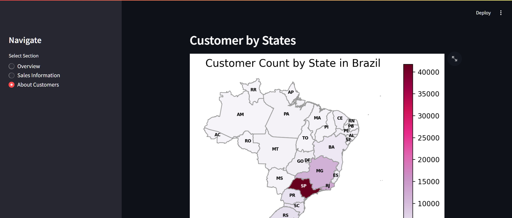

# Analysis Data E-Commerce

## Overview
This is a Data Analysis Project as part of the Dicoding course "Belajar Analisis Data". The project contains:

- Exploratory Data Analysis (EDA), which can be found in the provided Jupyter Notebook.
- A dashboard built using the Streamlit framework.

------------------------------------------------------

## How to Run

**Setup Virtual Environment**
Initiate the virtual environment by running:
```sh
python -m venv venv
source venv/bin/activate [Linux/MacOS]
venv/Scripts/activate [Windows]
```
or
```sh
conda create --name venv
conda activate venv
```

**Install Dependencies**
If you haven't install the dependencies, you can install them by running:
```sh 
pip install -r requirements.txt
```

**Run the Dashboard**
To launch the dashboard, run:
```
streamlit run src/main.py
```

----------------------------------------------------------

## Notes

+ The data analysis process is documented in src/analysis_notebook.ipynb
+ The dashboard logic can be found inside the src/main.py
+ The Data class follows the Singleton Design Pattern to avoid re-initialization, which can be time-consuming when working with large datasets.

-------------------

## Screenshots

### Overview


### Sales Information


### About Customers
